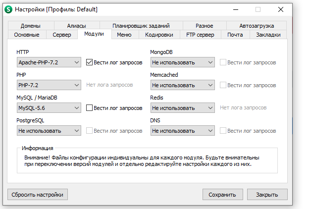

<p align="center">
    <h1 align="center">Yii 2 Advanced Простой пример</h1>
</p>

Yii 2 Advanced Project Template - демонстрационный вариант

В программе auth_item: admin, user

Пожалуйста, внимательно прочитайте инструкцию по развертованию проекта на своем ресурсе. Если кратко - config уже настроены,
файлы htaccess уже настроены, эмулятор сервера рекомендуется использовать OpenServer 
## В данном примере реализованно:
1. [Настройка проекта](#Настройка-проекта)
2. [Разграничение прав доступа к методам](#Разграничение-прав-доступа-к-методам)
3. [Вызов модального окна](#Вызов-модального-окна)
4. [Компонентная модель](#Компонентная-модель)
5. [Чтение файла](#Чтение-файла)
6. Пример выгрузки данных в excel, pdf, word (backend/controllers/OrganizationsController)
7. Пример работы с профилем пользователя, загрузка фото, смена пароля, настройка интерфейса (backend/controllers/UsersController)
8. [Скрины](#Скрины)

## Настройка проекта

1. После клонирования приложения с github: пишем в консоли composer update (для обновления зависимостей, формирование папки vendor)
2. Создаем БД и подключаем её в common/config/main.php и обязательно в файле main-local.php (для того, чтобы наши миграции заработали!) название БД: custom-yii2 (сравнение - utf8-general-ci)
Так же необходимо подключить почту для отправки писем Вам на почту об ошибках, или отправки пользователю результат регистрации
3. Применяем миграции:
3.1. php yii migrate --migrationPath=@yii/rbac/migrations 
3.2. php yii migrate
4. Все пути уже настроены в .htaccess файлах, обратите внимание что файлы .htaccess, лежат как в папках frontend/web, backend/web так и в корне проекта. Это необходимо для правильного перенаправления и корректного пути каталогов приложения.
5. Если Вы правильно все сделали приложение будет доступно по адресу: http://my-project-yii/, и http://my-project-yii/admin - backend часть
6. Миграции должы создать пользователя администратора: Логин: admin@gmail.com Пароль: 123456789
7. Настройки OpenServer
>__Настройки OpenServer:__
>
____
[:arrow_up:В данном примере реализованно](#В-данном-примере-реализованно)
___

## Разграничение прав доступа к методам

```
public function behaviors()
    {
        return [
            'access' => [
                'class' => AccessControl::className(),
                'rules' => [
                    [
                        'actions' => ['index', 'create', 'update', 'delete', 'onoff', 'exportk', 'export-excel'],
                        'allow' => true,
                        'roles' => ['admin', 'admin_organizations'],
                        'denyCallback' => function () {
                            Yii::$app->session->setFlash("error", "У Вас нет доступа к этой страницы, пожалуйста, обратитесь к администратору!");
                            return $this->redirect(Yii::$app->request->referrer);
                        }
                        //'roles' => ['@'], все зарегестрированные
                    ],
                    [
                        'actions' => ['index', 'view'],
                        'allow' => true,
                        'roles' => ['user_organizations'],
                        'denyCallback' => function () {
                            Yii::$app->session->setFlash("error", "У Вас нет доступа к этой страницы, пожалуйста, обратитесь к администратору!");
                            return $this->redirect(Yii::$app->request->referrer);
                        }
                    ],
                    [
                        'actions' => ['view', 'search', 'search-municipality', 'view-madal'],
                        'allow' => true,
                        'roles' => ['@'],
                    ],
                ],
                'denyCallback' => function ($rule, $action) {
                    Yii::$app->session->setFlash("error", "У Вас нет доступа к этой страницы, пожалуйста, обратитесь к администратору!");
                    return $this->redirect(Yii::$app->request->referrer);
                }
            ],
        ];
    }
```

____
[:arrow_up:В данном примере реализованно](#В-данном-примере-реализованно)
___

## Вызов модального окна

```
'view-madal' => function ($url, $model, $key) {
    return Html::button('Модальное окно с выбором', [
        'data_id' => $model->id,
        'class' => 'btn btn-sm btn-warning btn-block',
        'onclick' => '
            $.get("view-madal?id=" + $(this).attr("data_id"), function(data){
            $("#showModal .modal-body").empty();
            $("#showModal .modal-body").append(data);
            $("#showModal").modal("show");
        });'
    ]);                   
},
```
____
[:arrow_up:В данном примере реализованно](#В-данном-примере-реализованно)
___

## Скрины
>__Личный кабинет:__
>
>
>__Работа с организацией:__
>
>
>

____
[:arrow_up:В данном примере реализованно](#В-данном-примере-реализованно)
___