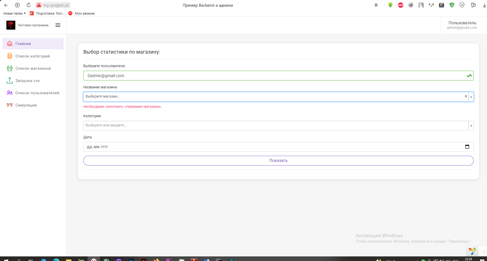
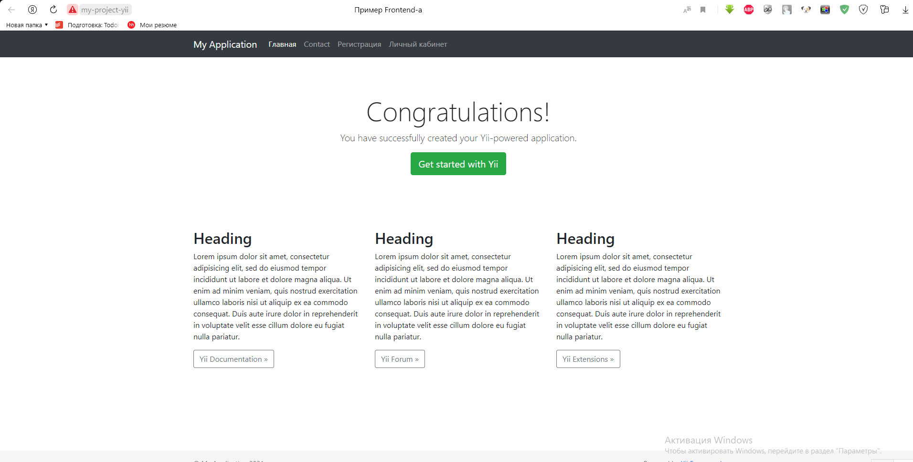

    <h1 align="center">Yii 2 Advanced Простой пример</h1>

Yii 2 Advanced Project Template - демонстрационный вариант

В программе auth_item: admin, user

Пожалуйста, внимательно прочитайте инструкцию по развертованию проекта на своем ресурсе. Если кратко - config уже настроены,
файлы htaccess уже настроены, эмулятор сервера рекомендуется использовать OpenServer 
## В данном примере реализованно:
1. [Настройка проекта](#Настройка-проекта)
2. [Рекомендации и описание](#Рекомендации-и-описание)
3. [Стартовые страницы](#Стартовые-страницы)

## Настройка проекта

1. Для запуска вам необходим сервер на Вашем ПК (лучше OpenServer/apache, его настройки приведены в п. 9)
2. После клонирования приложения с github: пишем в консоли composer update (для обновления зависимостей, формирование папки vendor) делаем это из консоли опен сервера!!!
3. Инициализируем проект: php init – для подготовки конфигурационных файлов (только не затираем основные файлы config -ов!) выбираем [0]  Development, далее пишем y
4. Создаем БД и подключаем её в common/config/main.php и обязательно в файле main-local.php (для того, чтобы наши миграции заработали!) название БД: custom-yii2 (сравнение - utf8-general-ci)
Так же необходимо подключить почту для отправки писем Вам на почту об ошибках, или отправки пользователю результат регистрации
4. Применяем миграции:
4.1. php yii migrate --migrationPath=@yii/rbac/migrations 
4.2. php yii migrate
5. Все пути уже настроены в .htaccess файлах, обратите внимание что файлы .htaccess, лежат как в папках frontend/web, backend/web так и в корне проекта. Это необходимо для правильного перенаправления и корректного пути каталогов приложения.
6. Если Вы правильно все сделали приложение будет доступно по адресу: http://my-project-yii/, и http://my-project-yii/admin - backend часть
7. Миграции должы создать пользователя администратора: Логин: admin@gmail.com Пароль: 123456789
8. Вы можете прочитать рекомендации для понимания что как работает
9. Настройки OpenServer
>__Настройки OpenServer:__
>
____
[:arrow_up:В данном примере реализованно](#В-данном-примере-реализованно)
___

## Рекомендации и описание
1. После успешного запуска Вы можете автоматически добавить пользователей и статистических данных нажав на кнопку: Симуляция
2. Графики реализованы на главной странице (если Вы под админом Вам сначало необходимо перевыбрать пользователя (фича далее будет устранена))
3. Если при регистрации возникла ошибка, вероятнее всего yii не может отправить письмо с пароем Вам на почту, проверте скорее всего пользователь создался (через кнопку регистраци во фронтенде).
4. Модели с поисковыми строками по внесению статистических данных добавлены в view backend\views\shop-info\view
5. Загрузка через cvs - пример файла можно посмотреть в папке backend\web\upl\example.csv можно загрузить его
6. Созданные пользователи симуляцией имеют одинаковый пароль как и у админа, но меньше возможностей
7. Фильтры на главной страницы для админа и юзера отличаются
8. У админа есть возможность автоматического входа в выбраного пользователя (Кнопка - список пользователей- красный значок) за ними можно работать и смотреть их статистику
9. У админа есть возможность просмотра списка магазинов и их информации (Кнопка - список пользователей- фиолетовый значок) в списке появяться все магазины пользователя - так же можно посмотреть и их статистику

____
[:arrow_up:В данном примере реализованно](#В-данном-примере-реализованно)
___

## Стартовые страницы
>
>

____
[:arrow_up:В данном примере реализованно](#В-данном-примере-реализованно)
___
